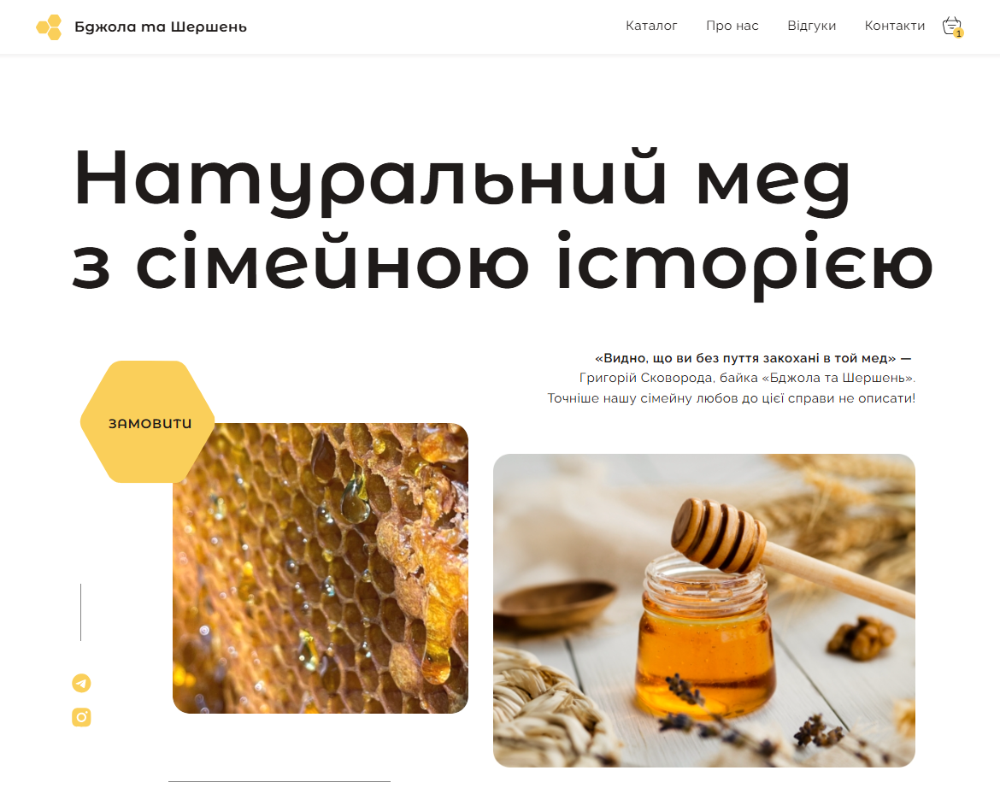

# README for "Бджола та Шершень" Landing Page

## Project Overview

**"Бджола та Шершень"** is a landing page website designed for a business that produces and sells honey and related products. The website provides detailed information about the company and serves as a platform for attracting new customers. The main goal of the project is to increase the customer base and sales volumes of the products offered by the business.

The target audience for this project consists of users across Ukraine who are interested in purchasing high-quality honey and related products.



## Features

- **Landing page design** for promoting honey and related products.
- **Responsive layout** to ensure the site is accessible and user-friendly across different devices and screen sizes.
- **Telegram bot integration** for automating the receipt of new orders.
- **API integration** with Nova Poshta for order delivery and tracking.
- **User-friendly interface** optimized for customer interaction and information retrieval.

## Non-functional Requirements

- **Accessibility:** The website is compatible with the following browsers:
  - Chrome
  - Firefox
  - Opera
    
- **Responsive Layouts:** The website is designed to be responsive and functional across multiple screen resolutions:
  - **Desktop:** 1440px width
  - **Tablet:** 768px width
  - **Mobile:** 375px width

## Technologies Used

- **Frontend:**
  - ReactJS
  - CSS
  - SwiperJS
  - React Router Hash Link
  - Redux Toolkit
  - Redux Persist
  - React Select
  - Formik
  - Yup
  - React Toastify
  - Overlayscrollbars React 
    
- **Backend:**
  - Firebase
  - Firebase Admin

## Localization

- The website is implemented in the **Ukrainian** language.

## Telegram Bot Integration

The project includes a **Telegram bot** to automate the process of receiving new order information.

- **Telegram Bot Token:**  
  `VITE_TG_BOT_TOKEN=`
  
- **Telegram Channel ID:**  
  `VITE_TG_CHANEL_ID=`

## API Integration with Nova Poshta

The project integrates with the **Nova Poshta API** to automate and streamline order delivery and tracking.

## Installation

1. Clone the repository:
   ```bash
   git clone <repository_url>
   
2. Install dependencies:
```
npm install
```

3. Set up environment variables in a .env file:
```
VITE_API_KEY=YOUR_FIREBASE_API_KEY
VITE_AUTH_DOMAIN=YOUR_FIREBASE_AUTH_DOMAIN
VITE_PROJECT_ID=YOUR_FIREBASE_PROJECT_ID
VITE_STORAGE_BUCKET=YOUR_FIREBASE_STORAGE_BUCKET
VITE_MESSAGING_SENDER_ID=YOUR_FIREBASE_MESSAGING_SENDER_ID
VITE_APP_ID=YOUR_FIREBASE_APP_ID
VITE_TG_BOT_TOKEN=YOUR_TELEGRAM_BOT_TOKEN
VITE_TG_CHANEL_ID=YOUR_TELEGRAM_CHANNEL_ID
```

4. Start the development server:
```
npm run dev
```

## Contact information

- Halyna Marchenko

- email: marchenkohalyna888@gmail.com
- Linkedin: https://www.linkedin.com/in/halyna-marchenko/

